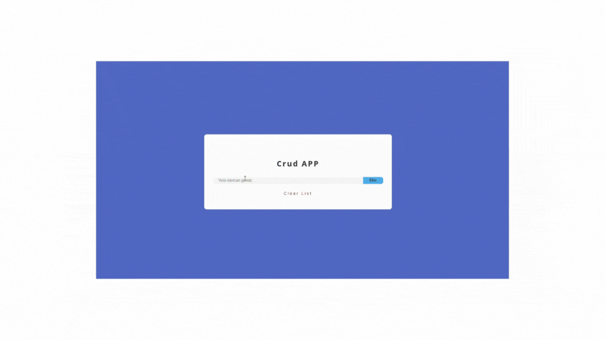

# Crud_App

<h2>"This CRUD application, built using HTML, CSS and JavaScript.
It allows adding, editing and deleting items. 
Additionally, when a crowded list is kept, the 'Clear List' function allows you to clear all the content with a single click. 
The application has a dynamic structure with JavaScript </h2>

# Technologies Used

<h2> 
<ul>
<li> HTML </li>   
<li> CSS </li>   
<li> JAVASCRIPT </li>   
</ul> 
</h2>

# 'GIF' of what it looks like

